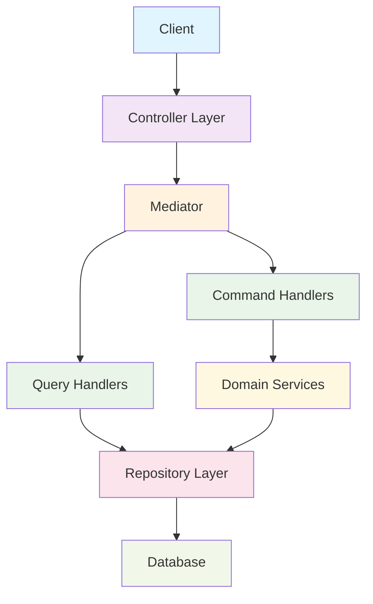
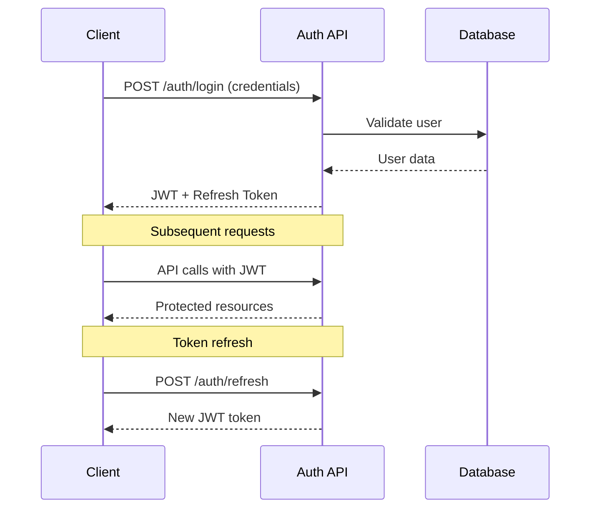
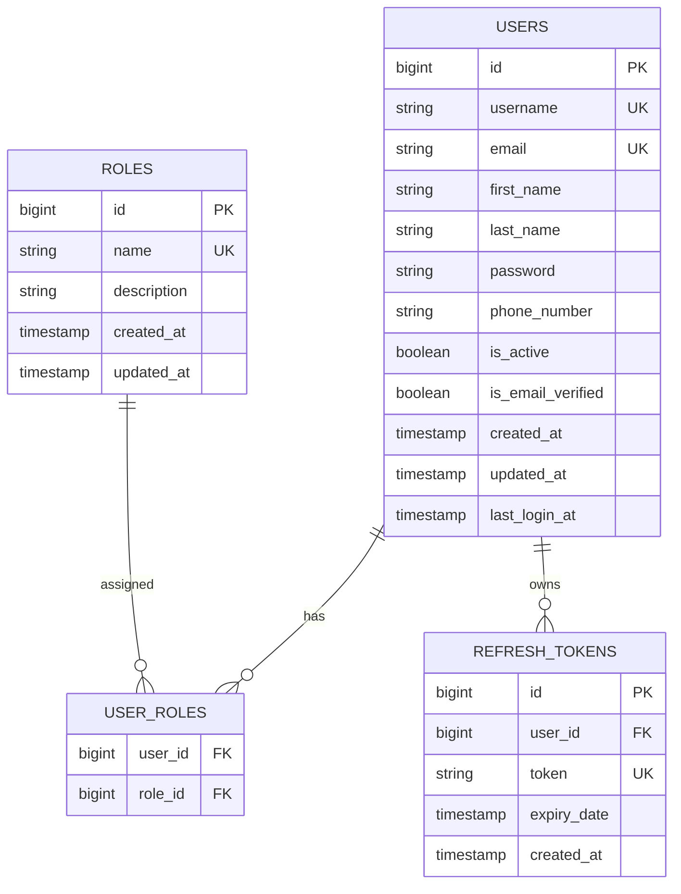

<div align="center">

# 🚀 User Management API

<p align="center">
  
  
  
  
  
</p>

<p align="center">
  <strong>Enterprise-grade user management system with modern architectural patterns</strong>
</p>

<p align="center">
  <a href="#-features">Features</a> •
  <a href="#-quick-start">Quick Start</a> •
  <a href="#-api-documentation">API Docs</a> •
  <a href="#-architecture">Architecture</a> •
  <a href="#-contributing">Contributing</a>
</p>


</div>

---

## 📋 Table of Contents

<details>
<summary>Click to expand</summary>

- [✨ Features](#-features)
- [🏗️ Architecture](#️-architecture)
- [🛠️ Technology Stack](#️-technology-stack)
- [⚡ Quick Start](#-quick-start)
- [🔐 Authentication](#-authentication)
- [📖 API Documentation](#-api-documentation)
- [🏛️ CQRS + MediatR](#️-cqrs--mediatr)
- [🔒 Security](#-security)
- [📊 Database Schema](#-database-schema)
- [🧪 Testing](#-testing)
- [🚀 Deployment](#-deployment)
- [📈 Performance](#-performance)
- [🤝 Contributing](#-contributing)
- [📄 License](#-license)

</details>

---

## ✨ Features

<table>
<tr>
<td width="50%">

### 🎯 Core Features
- **Clean Architecture** with CQRS pattern
- **MediatR Pattern** for request handling
- **JWT Authentication** + refresh tokens
- **Role-based Authorization** (RBAC)
- **RESTful API** design
- **OpenAPI/Swagger** documentation

</td>
<td width="50%">

### 🛡️ Security & Quality
- **Spring Security** integration
- **Input validation** & sanitization
- **Global exception** handling
- **Production-ready** logging
- **Database migrations** support
- **Unit & integration** testing

</td>
</tr>
</table>

---

## 🏗️ Architecture

<div align="center">



</div>

<details>
<summary><strong>🔍 Architecture Principles</strong></summary>

| Principle | Implementation |
|-----------|----------------|
| **Separation of Concerns** | Commands and queries handled separately |
| **Loose Coupling** | Controllers depend only on mediator interface |
| **Single Responsibility** | Each handler manages one specific operation |
| **Testability** | Easy unit testing with minimal dependencies |
| **Scalability** | Horizontal scaling ready architecture |

</details>

---

## 🛠️ Technology Stack

<div align="center">

| Category | Technologies |
|----------|-------------|
| **Backend** |   |
| **Security** |   |
| **Database** |   |
| **Documentation** |   |
| **Build Tools** |  |

</div>

---

## ⚡ Quick Start

<details>
<summary><strong>📋 Prerequisites</strong></summary>

- ☕ **Java 21+** installed
- 🐬 **MySQL 8.0+** running
- 📦 **Maven 3.6+** installed
- 🔧 **Git** for cloning

</details>

### 1️⃣ Clone Repository

```bash
git clone https://github.com/yourusername/usermanagement.git
cd usermanagement
```

### 2️⃣ Database Configuration

```properties
# src/main/resources/application.properties
spring.datasource.url=jdbc:mysql://localhost:3306/user_management
spring.datasource.username=your_username
spring.datasource.password=your_password
```

### 3️⃣ Run Application

```bash
./mvnw spring-boot:run
```

### 4️⃣ Access Points

<div align="center">

| Service | URL | Description |
|---------|-----|-------------|
| **API Base** | `http://localhost:8080/api` | Main API endpoint |
| **Swagger UI** | `http://localhost:8080/api/swagger-ui.html` | Interactive API docs |
| **API Docs** | `http://localhost:8080/api/v3/api-docs` | OpenAPI specification |
| **Health Check** | `http://localhost:8080/api/actuator/health` | Application health |

</div>

---

## 🔐 Authentication

<div align="center">

### 🔑 Default Credentials
```
👤 Username: admin
🔒 Password: admin123
```

</div>

### Authentication Flow



---

## 📖 API Documentation

<details>
<summary><strong>🔐 Authentication Endpoints</strong></summary>

| Method | Endpoint | Description | Request Body |
|--------|----------|-------------|--------------|
| `POST` | `/api/auth/login` | User login | `{username, password}` |
| `POST` | `/api/auth/refresh` | Refresh JWT | `{refreshToken}` |
| `POST` | `/api/auth/logout` | User logout | `{refreshToken}` |

</details>

<details>
<summary><strong>👥 User Management Endpoints</strong></summary>

| Method | Endpoint | Description | Authorization |
|--------|----------|-------------|---------------|
| `GET` | `/api/users` | List all users | `ADMIN, USER` |
| `GET` | `/api/users/{id}` | Get user by ID | `ADMIN, USER` |
| `POST` | `/api/users` | Create new user | `ADMIN` |
| `PUT` | `/api/users/{id}` | Update user | `ADMIN` |
| `DELETE` | `/api/users/{id}` | Delete user | `ADMIN` |

</details>

<details>
<summary><strong>🎭 Role Management Endpoints</strong></summary>

| Method | Endpoint | Description | Authorization |
|--------|----------|-------------|---------------|
| `GET` | `/api/roles` | List all roles | `ADMIN` |
| `POST` | `/api/roles` | Create new role | `ADMIN` |
| `PUT` | `/api/roles/{id}` | Update role | `ADMIN` |
| `DELETE` | `/api/roles/{id}` | Delete role | `ADMIN` |

</details>

---

## 🏛️ CQRS + MediatR

<div align="center">

### 📝 Command Pattern (Write Operations)

</div>

```java
// Command Definition
public class CreateUserCommand implements IRequest<UserDto> {
    private String username;
    private String email;
    private String firstName;
    private String lastName;
    // ... other fields
}

// Command Handler
@Component
public class CreateUserCommandHandler implements IRequestHandler<CreateUserCommand, UserDto> {
    
    @Override
    public UserDto handle(CreateUserCommand request) {
        // 1. Validate business rules
        // 2. Create user entity
        // 3. Save to database
        // 4. Return DTO
    }
}
```

<div align="center">

### 🔍 Query Pattern (Read Operations)

</div>

```java
// Query Definition
public class GetUserByIdQuery implements IRequest<UserDto> {
    private Long userId;
}

// Query Handler
@Component
public class GetUserByIdQueryHandler implements IRequestHandler<GetUserByIdQuery, UserDto> {
    
    @Override
    public UserDto handle(GetUserByIdQuery request) {
        // 1. Fetch user from database
        // 2. Map to DTO
        // 3. Return result
    }
}
```

<div align="center">

### 🎯 Simplified Controller

</div>

```java
@RestController
@RequestMapping("/api/users")
public class UserController {
    
    private final IMediator mediator;
    
    @PostMapping
    public ResponseEntity<UserDto> createUser(@RequestBody CreateUserCommand command) {
        return ResponseEntity.ok(mediator.send(command));
    }
    
    @GetMapping("/{id}")
    public ResponseEntity<UserDto> getUserById(@PathVariable Long id) {
        return ResponseEntity.ok(mediator.send(new GetUserByIdQuery(id)));
    }
}
```

---

## 🔒 Security

<div align="center">

### Security Features Matrix

| Feature | Implementation | Status |
|---------|----------------|---------|
| **Password Encryption** | BCrypt hashing | ✅ |
| **JWT Tokens** | Configurable expiration | ✅ |
| **Refresh Tokens** | Secure token rotation | ✅ |
| **RBAC** | Role-based access control | ✅ |
| **CORS** | Cross-origin configuration | ✅ |
| **Input Validation** | Bean validation + custom | ✅ |
| **SQL Injection** | JPA/Hibernate protection | ✅ |
| **XSS Protection** | Input sanitization | ✅ |

</div>

---

## 📊 Database Schema

<div align="center">



</div>

---

## 🧪 Testing

### Test Coverage

<div align="center">

| Test Type | Coverage | Status |
|-----------|----------|---------|
| **Unit Tests** | Controllers, Services | ✅ |
| **Integration Tests** | API endpoints | ✅ |
| **Security Tests** | Authentication flows | ✅ |
| **Database Tests** | Repository layer | ✅ |

</div>

### Running Tests

```bash
# Run all tests
./mvnw test

# Run with coverage report
./mvnw test jacoco:report

# Run integration tests only
./mvnw test -P integration-tests
```

---

## 🚀 Deployment

<details>
<summary><strong>🐳 Docker Deployment</strong></summary>

```dockerfile
FROM openjdk:21-jdk-slim

WORKDIR /app

COPY target/usermanagement-*.jar app.jar

EXPOSE 8080

HEALTHCHECK --interval=30s --timeout=3s --start-period=5s --retries=3 \
  CMD curl -f http://localhost:8080/api/actuator/health || exit 1

ENTRYPOINT ["java", "-jar", "/app.jar"]
```

```yaml
# docker-compose.yml
version: '3.8'
services:
  app:
    build: .
    ports:
      - "8080:8080"
    environment:
      - SPRING_DATASOURCE_URL=jdbc:mysql://db:3306/user_management
      - SPRING_DATASOURCE_USERNAME=root
      - SPRING_DATASOURCE_PASSWORD=password
    depends_on:
      - db
      
  db:
    image: mysql:8.0
    environment:
      MYSQL_ROOT_PASSWORD: password
      MYSQL_DATABASE: user_management
    ports:
      - "3306:3306"
```

</details>

<details>
<summary><strong>☁️ Cloud Deployment</strong></summary>

### AWS Deployment
- **ECS/Fargate** for containerized deployment
- **RDS MySQL** for managed database
- **Application Load Balancer** for high availability
- **CloudWatch** for monitoring and logging

### Azure Deployment
- **Container Instances** or **App Service**
- **Azure Database for MySQL**
- **Application Gateway** for load balancing
- **Azure Monitor** for observability

</details>

---

## 📈 Performance

<div align="center">

### Performance Metrics

| Metric | Value | Optimization |
|--------|--------|-------------|
| **Startup Time** | < 10s | Lazy initialization |
| **Memory Usage** | < 512MB | Optimized JVM settings |
| **Response Time** | < 200ms | Database indexing |
| **Throughput** | 1000+ req/s | Connection pooling |
| **Database Connections** | Pool: 10-20 | HikariCP optimization |

</div>

### Performance Features

- ⚡ **Lazy Loading**: Optimized JPA queries
- 🏊 **Connection Pooling**: HikariCP for database connections  
- 💾 **Caching Ready**: Redis integration ready
- 🔄 **Async Processing**: Non-blocking operations
- 📊 **Monitoring**: Spring Boot Actuator metrics

---

## 🤝 Contributing

<div align="center">

### How to Contribute

</div>

1. **🍴 Fork** the repository
2. **🌿 Create** a feature branch (`git checkout -b feature/amazing-feature`)
3. **💻 Commit** your changes (`git commit -m 'Add amazing feature'`)
4. **🚀 Push** to the branch (`git push origin feature/amazing-feature`)
5. **📝 Open** a Pull Request

### Development Guidelines

<details>
<summary><strong>📋 Code Standards</strong></summary>

- **Code Style**: Follow Google Java Style Guide
- **Testing**: Minimum 80% code coverage
- **Documentation**: JavaDoc for public APIs
- **Commits**: Conventional commit messages
- **Security**: OWASP guidelines compliance

</details>

---

## 📄 License

<div align="center">

This project is licensed under the **MIT License** - see the [LICENSE](LICENSE) file for details.

[](https://opensource.org/licenses/MIT)

</div>

---

## 📞 Support & Contact

<div align="center">

<p>
  <a href="https://github.com/kekolas12/usermanagement/issues">
    
  </a>
  <a href="mailto:mmeto340@gmail.com">
    
  </a>
  <a href="https://www.linkedin.com/in/mertcan-topdemir-575235295">
    
  </a>
</p>

**Questions?** Open an issue • **Bugs?** Report them • **Ideas?** Share them

</div>

---

<div align="center">

### ⭐ Star this repository if you found it helpful!


**Built with ❤️ using Spring Boot and modern architectural patterns**


</div>

- **Swagger UI**: http://localhost:8080/api/swagger-ui.html
- **OpenAPI JSON**: http://localhost:8080/api/api-docs

## API Endpoints

### Authentication

- `POST /api/auth/login` - Kullanıcı girişi
- `POST /api/auth/refresh` - Token yenileme
- `POST /api/auth/logout` - Kullanıcı çıkışı

### User Management

- `GET /api/users` - Kullanıcıları listele (ADMIN/MODERATOR)
- `GET /api/users/{id}` - Kullanıcı detayı (ADMIN/MODERATOR/OWN)
- `POST /api/users` - Yeni kullanıcı oluştur (ADMIN)
- `PUT /api/users/{id}` - Kullanıcı güncelle (ADMIN/OWN)
- `DELETE /api/users/{id}` - Kullanıcı sil (ADMIN)

## Varsayılan Kullanıcılar

Sistem başlangıçta şu kullanıcıyı oluşturur:

- **Username**: `admin`
- **Password**: `admin123`
- **Role**: `ADMIN`
- **Email**: `admin@usermanagement.com`

## Konfigürasyon

### application.properties

Uygulama ayarları `src/main/resources/application.properties` dosyasında bulunmaktadır:

```properties
# MySQL Database Configuration
spring.datasource.url=jdbc:mysql://localhost:3306/usermanagement
spring.datasource.username=root
spring.datasource.password=root

# JWT Configuration
jwt.secret=base64-encoded-secret-key
jwt.expiration=86400

# Server Configuration
server.port=8080
server.servlet.context-path=/api
```

## Veritabanı Şeması

### Ana Tablolar

1. **users** - Kullanıcı bilgileri
2. **roles** - Roller
3. **user_roles** - Kullanıcı-Rol ilişkisi
4. **refresh_tokens** - Refresh token'lar
5. **security_logs** - Güvenlik logları

### Migration Dosyaları

- `V1__Create_user_and_role_tables.sql` - Temel kullanıcı ve rol tabloları
- `V2__Create_token_tables.sql` - Token ve güvenlik tabloları

## Güvenlik

- **Password Encoding**: BCrypt ile şifreleme
- **JWT Token**: HS256 algoritması
- **Refresh Token**: 7 gün geçerlilik süresi
- **Access Token**: 24 saat geçerlilik süresi
- **Security Logging**: Tüm güvenlik olayları loglanır

## Roller

- **ADMIN**: Tüm işlemleri yapabilir
- **MODERATOR**: Kullanıcıları görüntüleyebilir
- **USER**: Kendi profilini yönetebilir

## Geliştirme

### Proje Yapısı

```
src/main/java/mertcan/usermanagement/
├── command/          # CQRS Command'lar
├── config/           # Konfigürasyon sınıfları
├── controller/       # REST Controller'lar
├── dto/              # Data Transfer Object'ler
├── entity/           # JPA Entity'ler
├── exception/        # Exception sınıfları
├── handler/          # Command/Query Handler'lar
├── query/            # CQRS Query'ler
├── repository/       # Repository interface'ler
├── security/         # Security sınıfları
└── service/          # Service sınıfları
```

### Yeni Özellik Ekleme

1. **Command/Query** oluşturun
2. **Handler** sınıfını yazın
3. **Controller** endpoint'ini ekleyin
4. **Test** yazın

## Test

```bash
# Unit testleri çalıştır
./mvnw test

# Integration testleri çalıştır
./mvnw verify
```

## Deployment

### Docker (Opsiyonel)

```dockerfile
FROM openjdk:24-jdk-slim
COPY target/usermanagement-0.0.1-SNAPSHOT.jar app.jar
EXPOSE 8080
ENTRYPOINT ["java","-jar","/app.jar"]
```

### Production Ayarları

Production için şu ayarları değiştirin:

- JWT secret key'i güvenli bir değerle değiştirin
- Database bağlantı bilgilerini güncelleyin
- Log seviyesini INFO/WARN olarak ayarlayın

## Lisans

Bu proje MIT lisansı ile lisanslanmıştır.
